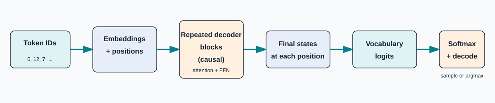

# Mathematics of LLMs, worked through in Go

This is a source-grounded learning path through Joseph L. Breeden's *The Simple Mathematics of Large Language Models*, with technical clarifications and a dependency-free Go forward-pass demonstration. It treats a decoder-only Transformer as a chain of ordinary operations: lookup, projection, dot product, masking, softmax, weighted sums, nonlinear transformations, and a final classifier.

{ .diagram }

Figure 1. The full path from token IDs to a distribution. The final decoding rule is outside the model's probability calculation.

## The learning path

1. Start with [tokens, the chain rule, and embeddings](notes/01-foundations.md).
2. Work through [causal self-attention](notes/02-context-attention.md), including the [visibility matrix](assets/images/causal-visibility.svg).
3. Study [heads, stacked blocks, residuals, and normalization](notes/03-relations-depth.md).
4. Compare [position methods, logits, probabilities, and decoding](notes/04-position-output.md).
5. Follow [training and inference](notes/05-training.md), then verify every number in the [end-to-end example](worked-example.md).
6. Keep [notation](notation.md), the [glossary](glossary.md), and the [equation reference](notes/07-equations.md) nearby.

## What the model answers

Given a prefix \(w_{1:t}\), an autoregressive language model produces

\[
P_\theta(w_{t+1}=v\mid w_{1:t})\quad\text{for every }v\in V.
\]

It does not directly output “the next word.” It outputs a distribution. Greedy choice, temperature, top-k, and nucleus sampling are separate decoding policies applied after that distribution exists.

## What the Go program demonstrates

`go/minillm` implements one causal attention head, sinusoidal absolute positions, two residual additions, a ReLU feed-forward transformation, vocabulary logits, and stable softmax. `DemoModel` contains fixed toy parameters. It is not trained, does not tokenize text, does not generate a meaningful continuation, and is not inference-ready. The [Go Lab](go-lab.md) maps each step to code and tests.

## How to read claims

- Source statement: a paraphrase of Breeden's supplied paper, cited by section.
- Mathematical consequence: follows from an equation and its stated assumptions.
- Technical clarification: added from standard Transformer references or from inspecting this repository.

The supplied PDF is not stored in this checkout, so page-level citations cannot be independently checked here. Source section numbers are retained from the existing project audit; primary references for added material appear on [Source and scope](source-notes.md).
