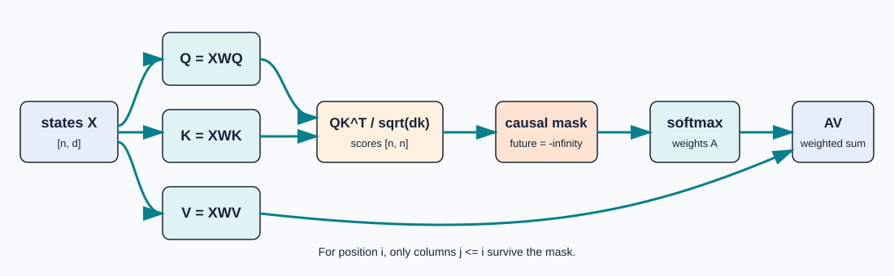
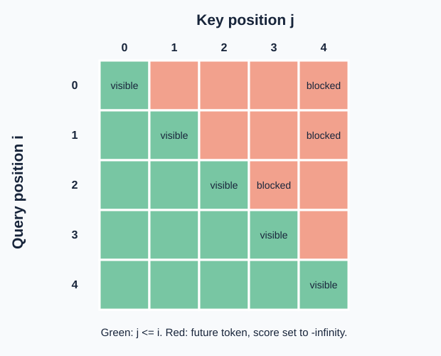

# 2. Causal self-attention

**Question:** Given a state at position \(i\), which earlier states should contribute, and what information should each contribute?

Breeden §§4–5 introduce learned weighted averaging. The standard scaled dot-product form and explicit mask below follow Vaswani et al. (2017).

{ .diagram }

Figure 2. One head computes compatibility with Q and K, then transports content through V. Future scores are masked before softmax.

## Projection roles and shapes

For input states \(x_i\in\mathbb R^d\), learned maps produce

\[
q_i=W_Qx_i,\qquad k_j=W_Kx_j,\qquad v_j=W_Vx_j,
\]

with \(W_Q,W_K\in\mathbb R^{d_k\times d}\), \(W_V\in\mathbb R^{d_v\times d}\), \(q_i,k_j\in\mathbb R^{d_k}\), and \(v_j\in\mathbb R^{d_v}\).

**Intuition:** a query describes what position \(i\) is looking for, a key describes what position \(j\) offers for matching, and a value carries the content to copy or blend. These are names for learned linear maps, not a literal database or conscious search.

## Scores, mask, and weights

The compatibility score is

\[
s_{ij}=\frac{q_i^\top k_j}{\sqrt{d_k}}.
\]

The division by \(\sqrt{d_k}\) keeps typical dot-product magnitudes from growing with width, which helps keep softmax gradients usable. For a decoder-only model, impose causality before normalization:

\[
\widetilde s_{ij}=\begin{cases}
s_{ij},&j\le i,\\
-\infty,&j>i.
\end{cases}
\qquad
\alpha_{ij}=\frac{e^{\widetilde s_{ij}}}{\sum_{r\le i}e^{\widetilde s_{ir}}}.
\]

The mask is not an annotation. It changes the denominator, so a future position has exactly zero attention weight in the mathematical idealization.

{ .diagram }

Figure 3. Row \(i\) may read columns \(j\le i\), never a future token. Inference uses the same rule one new position at a time.

The output is the weighted value sum

\[
z_i=\sum_{j\le i}\alpha_{ij}v_j\in\mathbb R^{d_v}.
\]

For all positions, \(Q,K\in\mathbb R^{n\times d_k}\), \(V_{\rm val}\in\mathbb R^{n\times d_v}\), the score and weight matrices are \(n\times n\), and the output is \(Z\in\mathbb R^{n\times d_v}\).

## Numerically stable softmax

Directly computing \(e^{s_j}\) can overflow. Let \(m=\max_j s_j\) over the **allowed** row. Then

\[
\operatorname{softmax}(s)_j
=\frac{e^{s_j-m}}{\sum_r e^{s_r-m}}.
\]

Subtracting one constant leaves every ratio unchanged. For scores \((1000,1001,999)\), use \((-1,0,-2)\) instead; the resulting probabilities are finite and sum to one. This is the operation tested by `Softmax` in `math.go`.

## Worked weighted sum

If \(v_1=(1,0)\), \(v_2=(0,2)\), and \(\alpha=(0.25,0.75)\), then

\[
z=0.25(1,0)+0.75(0,2)=(0.25,1.5).
\]

The output is a convex combination: it lies in the line segment between the values. The query-key scores decide the coefficients; the values decide what is transported. The complete numerical path, including logits, is in the [end-to-end example](../worked-example.md).

## What attention does not prove

Separate \(W_Q\) and \(W_K\) allow directional compatibility:

\[
q_i^\top k_j=x_i^\top W_Q^\top W_Kx_j.
\]

The weights are useful computational diagnostics, but they are not by themselves a complete explanation of a prediction. Residual streams, later layers, nonlinearities, and output weights also contribute. “Attention is explanation” is an interpretive claim, not a consequence of the weighted-sum equation.

## Go connection and invariant

`CausalAttention` in `go/minillm/attention.go` materializes scores only for `j <= i`, calls stable `Softmax`, and accumulates `weight * value`. `TestCausalAttentionDoesNotReadFutureValues` changes only a future value row and verifies that earlier output rows do not change. It also verifies that the final row can change, so the test is not merely checking a constant output.

## Self-check

1. Why must the mask be applied before the softmax denominator is formed?
2. What are the shapes of \(QK^\top\) and \(AV_{\rm val}\)?
3. If all allowed scores are equal, what are the weights at position \(i\)?

<small>Source: Breeden §§4–5. Primary reference: Vaswani et al., [*Attention Is All You Need*](https://arxiv.org/abs/1706.03762), §3.2.1.</small>
