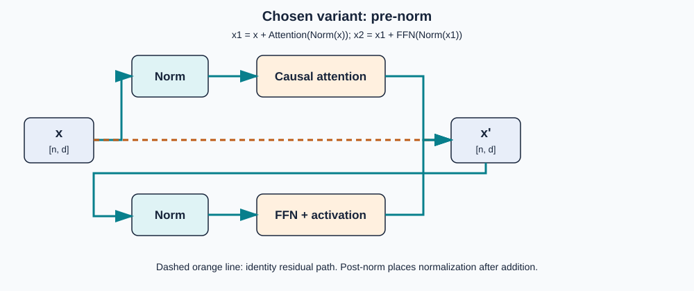

# 3. Heads, depth, and decoder blocks

**Question:** Why repeat attention in parallel and in depth instead of using one weighted average?

Breeden §§6–7 use “relations” and layers to explain this. The implementation details below distinguish what the equations permit from what training actually produces.

## Multiple heads

Head \(h\) has its own projections and produces

\[
Z^{(h)}=\operatorname{Attention}(XW_Q^{(h)},XW_K^{(h)},XW_V^{(h)})
\in\mathbb R^{n\times d_v}.
\]

Concatenate along the feature dimension and project back to model width:

\[
Y=\operatorname{Concat}(Z^{(1)},\ldots,Z^{(H)})W_O,
\]

where the concatenated matrix is \(n\times Hd_v\), \(W_O\in\mathbb R^{Hd_v\times d}\) under row-vector notation, and \(Y\in\mathbb R^{n\times d}\). With column-vector notation, transpose the displayed matrix orientation; the per-position dimensions are unchanged.

**Intuition:** parallel projections give the layer several compatibility/content subspaces at the same time. One head could focus on a nearby token while another uses a longer dependency. **Limit:** the architecture permits different patterns; it does not guarantee that head 1 is “syntax” and head 2 is “coreference.” Heads can overlap or be redundant.

The current Go code has one head and therefore no concatenation step. `WQ`, `WK`, and `WV` are square `[width, width]` matrices; `WO` maps the one head back to the same width.

## Feed-forward transformation

Attention mixes information across positions. A position-wise feed-forward network then transforms each position independently using shared weights:

\[
\operatorname{FFN}(x)=W_2\,\phi(W_1x+b_1)+b_2.
\]

For \(x\in\mathbb R^d\), hidden width \(d_{ff}\), \(W_1\in\mathbb R^{d_{ff}\times d}\), \(W_2\in\mathbb R^{d\times d_{ff}}\), the result returns to \(\mathbb R^d\). The nonlinearity \(\phi\) is essential: two linear maps without it collapse to one linear map. The source illustrates ReLU, \(\operatorname{ReLU}(a)=\max(0,a)\); modern models also use GELU or gated variants.

Example: \(W_1x+b_1=(-2,0.5,3)\) becomes \((0,0.5,3)\) under ReLU. Negative hidden coordinates are clipped, so later linear mixing can implement a piecewise-linear transformation.

## Residuals and normalization

{ .diagram }

Figure 4. Chosen variant: pre-norm. The orange dashed route is an identity residual; post-norm and other layouts are also used.

The diagram chooses the common pre-norm schematic

\[
x_1=x+\operatorname{Attention}(\operatorname{Norm}(x)),
\qquad
x_2=x_1+\operatorname{FFN}(\operatorname{Norm}(x_1)).
\]

A residual connection computes \(x+f(x)\), retaining an identity route around each sublayer. That route supplies a direct derivative contribution and often makes deep optimization easier; it does not guarantee non-vanishing gradients.

Normalization controls feature scale. LayerNorm for a vector \(x\in\mathbb R^d\) typically normalizes using its feature mean and variance, then applies learned scale and shift. RMSNorm uses a root-mean-square scale and does not subtract the mean. Architectures also differ in placement: **pre-norm** normalizes before a sublayer, while **post-norm** normalizes after the residual addition. The source's statement that every sub-operation leaves mean 0 and variance 1 is a useful simplification, not a universal Transformer layout.

## Stacking layers

Let \(X^{(0)}\) be embeddings plus positions and \(X^{(\ell)}=\operatorname{Block}_\ell(X^{(\ell-1)})\). Every causal block preserves the rule that position \(i\) cannot directly read \(j>i\). Later layers can nevertheless use features that earlier positions already aggregated from their own prefixes. Depth composes local operations into richer conditional features; it does not make the context window infinite.

## Go boundary

`Model.Forward` performs one attention pass, then for every position applies `WO`, a residual, `W1`, `relu`, `W2`, and another residual. It intentionally omits normalization, biases, multiple heads, and multiple configurable layers. Read it as a concrete one-block variant, not as a claim that all decoder blocks have this exact layout.

## Self-check

1. If \(H=4\) and each head has \(d_v=16\), what is the concatenated width before \(W_O\)?
2. Which part of a block mixes positions, and which part transforms positions independently?
3. What would change in the equations if post-norm were chosen instead of pre-norm?

<small>Source: Breeden §§6–7. Primary references: Vaswani et al. (2017), §3.2; Ba et al., [*Layer Normalization*](https://arxiv.org/abs/1607.06450); Zhang and Sennrich, [*Root Mean Square Layer Normalization*](https://arxiv.org/abs/1910.07467).</small>
