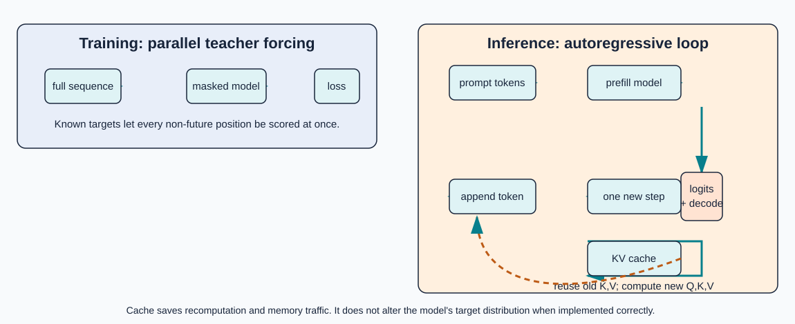

# 5. Training, inference, and the KV cache

**Question:** How are the fitted parameters chosen, and why is serving a prompt different from training on it?

Breeden §10 introduces likelihood and gradient updates. The prefill/decode distinction and cache explanation below are implementation clarifications.

## Maximum likelihood and cross-entropy

For a tokenized sequence, the chain rule gives

\[
\log P_\theta(w_{1:n})=\sum_{t=1}^{n}\log P_\theta(w_t\mid w_{<t}).
\]

Maximum likelihood chooses parameters that make observed continuations probable. Minimizing negative log-likelihood, often averaged over \(N\) target tokens, is equivalent:

\[
\mathcal L(\theta)=-\frac1N\sum_{t=1}^{N}\log P_\theta(w_t\mid w_{<t}).
\]

For one target with one-hot label \(y\), categorical cross-entropy is

\[
\operatorname{CE}(y,p)=-\sum_{v\in V}y_v\log p_v=-\log p_{\text{target}}.
\]

If the target probability is \(0.8\), the loss is \(-\log(0.8)\approx0.2231\); if it is \(0.1\), the loss is \(2.3026\). The loss is a measure of assigned probability, not a direct measure of truth or quality. The [worked example](../worked-example.md) computes one from scratch.

## The chain rule in backpropagation

The forward pass is a composition \(f_\theta\) of lookups, matrix products, nonlinearities, and softmax. Backpropagation applies the chain rule to compute the gradient of the scalar loss with respect to every parameter:

\[
\theta\leftarrow\theta-\eta\nabla_\theta\mathcal L(\theta).
\]

Here \(\eta\) is a learning rate. Real training uses minibatches, masking for padding, mixed precision, and often Adam-style optimizers. A minibatch gradient can estimate the full-corpus gradient under sampling assumptions, but stochasticity and a non-convex objective do not provide a universal guarantee of reaching a global optimum.

## Training versus inference

{ .diagram }

Figure 5. Training scores known targets in parallel. Inference first prefills a prompt, then loops over one newly selected token at a time; the cache reuses prior keys and values.

### Training

With a known sequence, the model processes all positions in one tensor. The causal mask ensures position \(i\) cannot use later target tokens. Every eligible position supplies a loss term, so the expensive matrix operations are parallelized across positions.

### Inference

Generation has an actual loop:

1. Tokenize the prompt and enforce the context limit.
2. Run the prompt through the model (**prefill**) and retain the final logits.
3. Apply a decoding policy, such as greedy choice or sampling.
4. Append the selected token and stop on EOS or a length limit.
5. Process the new position, decode again, and repeat.

Inference cannot use an unknown future token. At each step it asks only for the next conditional distribution.

## What the KV cache saves

At a new decoding step, old keys and values are unchanged if the model and prefix are unchanged. A KV cache stores those projected rows. The new query is compared with cached keys plus the new key, and the resulting weights aggregate cached values plus the new value. This avoids recomputing old projections and old attention rows.

The cache does **not** change the mathematics of the distribution, remove the new query computation, make attention bidirectional, or make a context window unlimited. It trades memory for less repeated computation and is specific to a compatible model configuration. Cached and uncached logits should agree within a documented floating-point tolerance.

## Go implementation boundary

The repository has no training loop, gradients, optimizer, inference loop, or cache. `Forward` recomputes every supplied position and returns only the final probability vector. `inference-readiness.md` is a roadmap, not a claim that these features exist.

## Self-check

1. Why can training score many positions in parallel but generation must wait for the selected token?
2. Which tensors are cached, and which new tensor is still needed for the current query?
3. Does lowering cross-entropy prove the generated text is factually correct? Why not?

<small>Source: Breeden §10. Primary references: Vaswani et al. (2017), §5.3; Kwon et al., [*Efficient Memory Management for Large Language Model Serving with PagedAttention*](https://arxiv.org/abs/2309.06180) for serving/cache context.</small>
